# 45Flow User Guide

Welcome to **45Flow** — the secure file sharing and collaboration platform by 45Drives. This guide walks you through installing the application, connecting to your server, and using every feature from start to finish.

## About 45Flow Editions

45Flow is available in two modes:

- **Community Edition** — Free unlicensed version. Includes all core file sharing, review, and upload features with basic watermarking.
- **Pro Edition** — Unlocked when your server is licensed. Adds custom branding (white label), advanced watermark customization, timecoded comments, annotations, and priority support.

**The app works the same way for everyone** — it starts in Community mode by default, and automatically upgrades to Pro when connected to a licensed server. No separate downloads or builds. When unlicensed, Pro features are simply hidden or disabled in the UI.

**Licensing is server-side** — your 45Flow license is tied to your houston-broadcaster server, not to individual user accounts. Once a server is licensed, all users connecting to it gain access to Pro features automatically.

---

## Table of Contents

1. [System Requirements](#1-system-requirements)
2. [Installation](#2-installation)
   - [macOS](#macos)
   - [Windows](#windows)
   - [Linux](#linux)
3. [Getting Started — Connecting to Your Server](#3-getting-started--connecting-to-your-server)
   - [Automatic Server Discovery](#automatic-server-discovery)
   - [Manual Connection via IP](#manual-connection-via-ip)
   - [Custom Port Configuration](#custom-port-configuration)
   - [Logging In](#logging-in)
   - [License Status & Activation](#license-status--activation)
4. [Dashboard Overview](#4-dashboard-overview)
5. [Projects — Organizing Your Links](#5-projects--organizing-your-links)
   - [What Are Projects](#what-are-projects)
   - [Creating a Project](#creating-a-project)
   - [Managing Projects](#managing-projects)
6. [Port Forwarding for External Sharing](#6-port-forwarding-for-external-sharing)
7. [Settings](#7-settings)
   - [URLs & Access](#urls--access)
   - [SSL Certificate Management](#ssl-certificate-management)
   - [Link Options](#link-options)
   - [Project Root](#project-root)
   - [Preferences & Performance](#preferences--performance)
   - [Server Health](#server-health)
   - [Maintenance & Cleanup](#maintenance--cleanup)
   - [Go Pro — License Activation](#go-pro--license-activation)
   - [Guides](#guides)
8. [Custom Branding (White Label) — Pro Feature](#8-custom-branding-white-label--pro-feature)
   - [Enabling Branding](#enabling-branding)
   - [Company Identity](#company-identity)
   - [Theme & Colors](#theme--colors)
   - [Company Logo](#company-logo)
   - [Support & Contact Information](#support--contact-information)
   - [Link Preview Metadata](#link-preview-metadata)
   - [Live Preview](#live-preview)
   - [Clearing Branding](#clearing-branding)
9. [Drag and Drop QuickShare](#9-drag-and-drop-quickshare)
10. [Creating Links — Share, Upload, or Combined](#10-creating-links--share-upload-or-combined)
    - [Step 1: Select a Project or Destination](#step-1-select-a-project-or-destination)
    - [Step 2: Configure Link Settings](#step-2-configure-link-settings)
    - [Link Types — Share, Upload, Combined](#link-types--share-upload-combined)
    - [Link Access Modes](#link-access-modes)
    - [Advanced Video Options](#advanced-video-options)
    - [Watermark Settings — Video and Image Support](#watermark-settings--video-and-image-support)
    - [Generating the Link](#generating-the-link)
11. [Upload Files Locally](#11-upload-files-locally)
    - [Step 1: Select Local Files](#step-1-select-local-files)
    - [Step 2: Choose Destination](#step-2-choose-destination)
    - [Step 3: Upload & Monitor Progress](#step-3-upload--monitor-progress)
12. [Transfer Dock](#12-transfer-dock)
    - [Transfer Dock Overview](#transfer-dock-overview)
    - [Transfer Entry Details](#transfer-entry-details)
    - [Transcode Status](#transcode-status)
13. [Managing Links](#13-managing-links)
    - [Searching & Filtering Links](#searching--filtering-links)
    - [Link Table Columns](#link-table-columns)
    - [Link Actions](#link-actions)
14. [Link Details](#14-link-details)
    - [Link Configuration Summary](#link-configuration-summary)
    - [Shared Files](#shared-files)
    - [Access Activity Log](#access-activity-log)
    - [File Versions](#file-versions)
    - [Comments Review & Export](#comments-review--export)
15. [Editing a Link](#15-editing-a-link)
16. [Accessing a Shared Link](#16-accessing-a-shared-link)
    - [Opening the Link](#opening-the-link)
    - [Password-Protected Links](#password-protected-links)
    - [User-Restricted Links](#user-restricted-links)
17. [Video Player, Comments & Annotations](#17-video-player-comments--annotations)
    - [Playback Controls](#playback-controls)
    - [Quality Selection](#quality-selection)
    - [Timecoded Comments](#timecoded-comments)
    - [Annotations & Drawing Tools](#annotations--drawing-tools)
    - [Multi-File Shares](#multi-file-shares)
18. [User Management](#18-user-management)
    - [Viewing Existing Users](#viewing-existing-users)
    - [Creating a New User](#creating-a-new-user)
    - [Managing Groups](#managing-groups)
    - [Editing & Deleting Users](#editing--deleting-users)
19. [Role Management](#19-role-management)
    - [System Roles](#system-roles)
    - [Creating Custom Roles](#creating-custom-roles)
    - [Editing & Deleting Roles](#editing--deleting-roles)
20. [Multi-Server Management](#20-multi-server-management)
    - [Adding Servers](#adding-servers)
    - [Switching Active Server](#switching-active-server)
    - [Server Filter (All Servers View)](#server-filter-all-servers-view)
21. [Automatic Updates](#21-automatic-updates)
    - [Update Notifications](#update-notifications)
    - [Downloading & Installing Updates](#downloading--installing-updates)
    - [Linux Package Updates](#linux-package-updates)
22. [View Logs](#22-view-logs)
    - [Client Logs](#client-logs)
    - [Server Logs (Audit Log)](#server-logs-audit-log)
    - [Multi-Server Log Viewer](#multi-server-log-viewer)
    - [Searching & Filtering Logs](#searching--filtering-logs)
23. [Frequently Asked Questions](#23-frequently-asked-questions)

---

## 1. System Requirements

| Platform | Requirement |
|----------|-------------|
| **macOS** | macOS 10.15 (Catalina) or later, Intel or Apple Silicon |
| **Windows** | Windows 10 or later (64-bit) |
| **Linux** | Ubuntu 20.04+ (DEB), Rocky/RHEL 8+ (RPM), or any x86_64 Linux (AppImage) |
| **Network** | LAN access to your 45Drives server. For external sharing, HTTPS port 443 must be forwarded from your router. |

---

## 2. Installation

Download the latest version of 45Flow from the **[Releases page](https://github.com/45Drives/45flow/releases)**. Under the **Assets** section of the latest release, download the file matching your operating system.

### macOS

| Chip | File to Download |
|------|-----------------|
| Apple Silicon (M1, M2, M3, M4…) | `45Flow-*-mac-arm64.dmg` |
| Intel | `45Flow-*-mac-x64.dmg` |

1. Double-click the downloaded `.dmg` file.
2. In the window that appears, drag the **45Flow** icon into the **Applications** folder.
3. Open **45Flow** from your Applications folder or Launchpad.

> **Tip:** If macOS warns the app is from an unidentified developer, go to **System Preferences → Security & Privacy** and click **Open Anyway**.

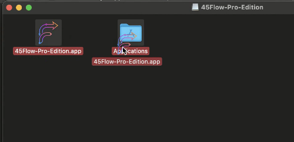

### Windows

| File to Download |
|-----------------|
| `45Flow-*-win-x64.exe` |

1. Double-click the downloaded `.exe` installer.
2. Follow the on-screen installation wizard steps.
3. Once complete, launch **45Flow** from the Start Menu or Desktop shortcut.

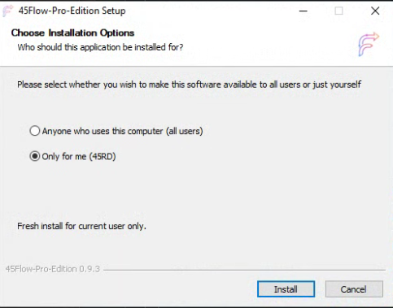

### Linux

Three package formats are available:

| Distribution | File | Install Command |
|-------------|------|-----------------|
| Ubuntu / Debian | `45Flow-*-linux-amd64.deb` | `sudo apt install ./45Flow-*-linux-amd64.deb` |
| Rocky / RHEL / Fedora | `45Flow-*-linux-x86_64.rpm` | `sudo dnf install ./45Flow-*-linux-x86_64.rpm` |
| Any Linux (portable) | `45Flow-*-linux-x86_64.AppImage` | No installation required |

**DEB / RPM Installation:**

1. Download the appropriate package file for your distribution.
2. Open a terminal and run the install command above, replacing `*` with the version number.
3. Launch **45Flow** from your application menu.

**AppImage (Portable):**

The AppImage is a self-contained portable executable that runs on any modern x86_64 Linux distribution without installation.

1. Download the `.AppImage` file.
2. Make it executable: `chmod +x 45Flow-*-linux-x86_64.AppImage`
3. Double-click the file or run it from the terminal: `./45Flow-*-linux-x86_64.AppImage`

The AppImage requires no root privileges and does not modify your system. It supports automatic updates — when a new version is available, the app will download and replace itself in place.

> **Tip:** Move the AppImage to a convenient location like `~/Applications/` or `/opt/` for easy access. You can also right-click → "Create Desktop Entry" in many file managers.

---

## 3. Getting Started — Connecting to Your Server

When you first open 45Flow, you'll see the **Login Screen**. This is where you connect the desktop client to your 45Drives server.


### Automatic Server Discovery

If your server is running the **houston-broadcaster** service on the same network, it will appear automatically in the **"Select a server"** dropdown. Each entry shows the server's hostname and IP address.

Simply select your server from the dropdown to populate the connection.


> **Note:** If no servers appear, the houston-broadcaster service may not be running, or you may be on a different subnet. Use the manual connection method below.

### Manual Connection via IP

If your server doesn't appear automatically:

1. Find the **"Connect manually via IP"** field.
2. Enter your server's IP address (e.g., `192.168.1.123`).

### Custom Port Configuration

In most cases, the default ports work without changes. If your server uses non-standard ports, click **"Configure Ports"** to expand the port settings:

| Port | Default | Purpose |
|------|---------|---------|
| **SSH** | 22 | Secure shell communication |
| **API** | 9095 | Server communication and link management |
| **HTTPS** | 443 | Share links, upload links, external access |

> **Important:** For external sharing the HTTPS port (443 by default) must be open/forwarded on your router. See [Port Forwarding](#5-port-forwarding-for-external-sharing) for details.

### Logging In

1. Enter your server **Username** (e.g., `root`).
2. Enter your **Password**.
3. Click **"Connect to Server"**.

The app will display status messages as it connects:
- *"Preparing SSH…"*
- *"Bootstrapping…"*
- *"Checking server health…"*

On success, you'll be taken to the **Dashboard**.


### License Status & Activation

After connecting to your server, 45Flow automatically checks the server's license status in the background. **Login is never blocked** — you can start using the app immediately, even if the server is unlicensed.

#### Community vs Pro Mode

- **Unlicensed server** — The app runs in Community mode. Pro features (custom branding, advanced watermarks, comments, annotations) are hidden or disabled.

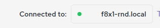

- **Licensed server** — The app automatically upgrades to Pro mode. All Pro features become available.
- **Trial license** — If your server has an active trial license, the app shows "Pro Trial — X days left" in the header. When the trial expires, the app reverts to Community mode.

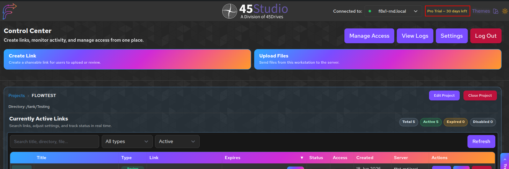

#### Activating a License

If your server is unlicensed, you can activate a license at any time:

1. Open **Settings** from the Dashboard.
2. Navigate to **Go Pro** in the left sidebar.
3. Enter your **License Key** provided by 45Drives.
4. Click **"Activate License"** to validate and activate.

Once activated, the app immediately upgrades to Pro mode and all Pro features unlock.

> **Note:** Licenses are tied to the server, not individual users. Once a server is licensed, all users connecting to it automatically gain Pro features.

#### Starting a Trial

If you don't have a license key yet, you can start a **30-day free trial** directly from the Go Pro settings section. Trials give you full access to all Pro features for evaluation.

After successful login, you'll be directed to the **Dashboard** to begin using 45Flow.

---

## 4. Dashboard Overview

The **Dashboard** (also called the **Control Center**) is your central hub for managing all file sharing operations.

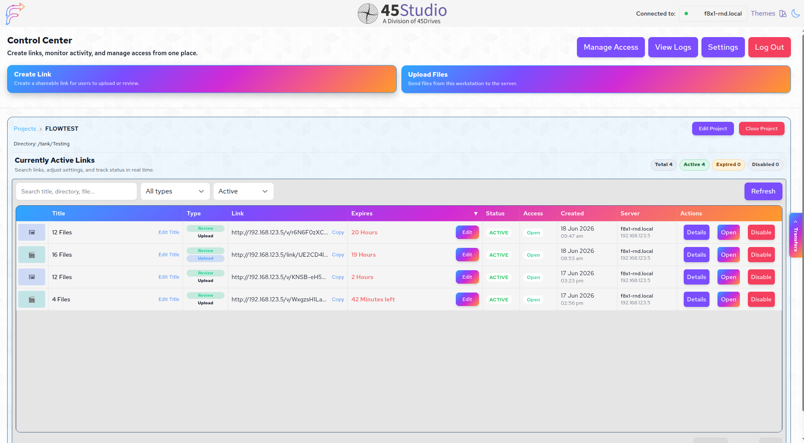

### Top Navigation

At the top of the Dashboard, you'll find quick-access buttons:

| Button | Description |
|--------|-------------|
| **Manage Users** | Open user management to create accounts, assign roles, and manage access |
| **View Logs** | Open the log viewer to inspect application activity and diagnose issues |
| **Settings** | Configure application-wide defaults for links, URLs, and server behavior |

### Main Action Buttons

Three large action buttons let you perform the core tasks:

| Button | Description |
|--------|-------------|
| **New Link** | Create a link for sharing files, uploading files, or both (combined mode). Configure all link settings in one unified interface. |
| **Upload Files Locally** | Transfer files from your workstation directly to the server |
| **Manage Projects** | Organize your links into projects for better organization |

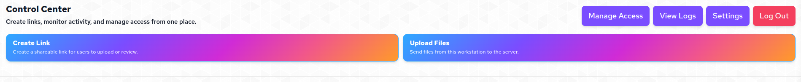

### Active Links Table

Below the action buttons, the Dashboard displays a table of **all links** you've created, with search/filter tools and at-a-glance status information. See [Managing Links](#13-managing-links) for full details.

### Logging Out

Click **"Log Out"** at the bottom of the Dashboard to disconnect from the server and return to the Login Screen.

---

## 5. Projects — Organizing Your Links

**Projects** let you organize your links into logical groups, making it easier to manage shares for different clients, departments, or workflows. Each project has its own root directory on your server and tracks all links associated with it.

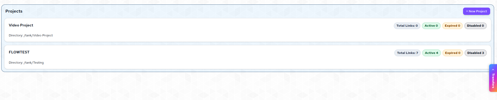

### What Are Projects

A project is a named container that:

- **Groups related links** — Keep all links for a client, campaign, or workflow together in one place.
- **Has a root directory** — Each project points to a specific folder on your server. When creating links within a project, you start browsing from that root.
- **Tracks link counts** — See at a glance how many active, expired, or disabled links each project has.
- **Can be archived** — Archive completed projects to hide them from the active list without deleting the links.

### Creating a Project

To create a new project:

1. From the Dashboard, click **"Manage Projects"** (or navigate to **Settings → Projects**).
2. Click **"New Project"**.
3. Enter:
   - **Project Name** — A descriptive name (e.g., "Acme Corp Review", "Q1 Marketing Assets").
   - **Root Directory** — The absolute path on the server where this project's files live (e.g., `/tank/projects/acme`).
   - **Description** (optional) — Notes about the project's purpose.
4. Click **"Create Project"**.

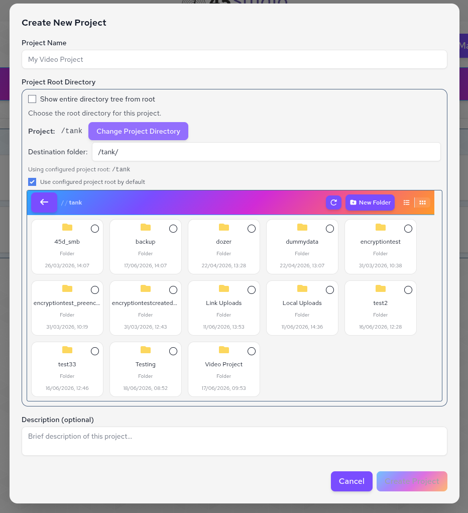

The new project appears in the projects list and is immediately available when creating links.

### Managing Projects

**Viewing Projects:**

The Projects panel shows all active projects with:
- Project name
- Root directory path
- Link counts (total, active, expired, disabled)
- Created date

**Editing a Project:**

Click the **edit icon** next to a project to update its name, root directory, or description.

**Archiving a Project:**

Click the **archive icon** to soft-delete a project. Archived projects are hidden from the active list but can be restored later. All links in an archived project remain accessible — archiving does not delete links.

**Restoring an Archived Project:**

Toggle **"Show archived"** to view archived projects, then click **"Restore"** to unarchive.

**Deleting a Project (Hard Delete):**

To permanently delete a project and all its links, select the project and choose **"Delete Permanently"**. This action cannot be undone.

> **Tip:** Projects are optional. You can still create links without associating them to a project — they'll appear in the "All Links" view on the Dashboard.

---

## 6. Port Forwarding for External Sharing

To share files externally (over the internet), HTTPS port **443** (or your custom HTTPS port) must be forwarded from your router to your server. **This is a critical setup step for external sharing** — complete it before creating external links.

**What is port forwarding?**  
Port forwarding tells your router to direct incoming traffic on a specific port to your server's local IP address, allowing people outside your network to access your share links.

**General Steps:**

1. Log into your router's admin panel (usually at `192.168.1.1` or `192.168.0.1`).
2. Find the **Port Forwarding** or **NAT** settings section.
3. Create a new rule:
   - **External port:** 443 (or your custom HTTPS port)
   - **Internal IP:** Your server's local IP address
   - **Internal port:** 443 (or your custom HTTPS port)
   - **Protocol:** TCP
4. Save the rule and test using the **"Check Port"** button in the 45Flow link creation screen.

> **Note:** Port forwarding configuration varies by router manufacturer and model. Some ISPs or shared building networks may restrict port forwarding. If you're unsure whether your network supports it, contact your ISP or network administrator.

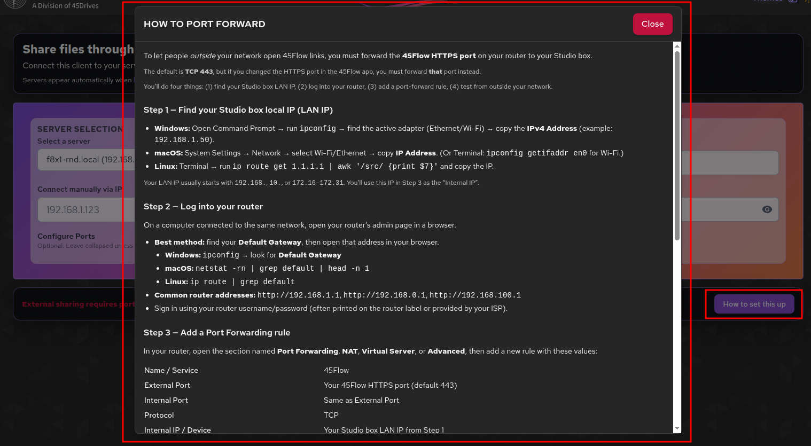

> **Tip:** After setting up port forwarding, configure your external URL in [Settings](#6-settings) → URLs & Access to ensure links are generated correctly.

---

## 7. Settings

Configure application-wide defaults and server settings. Access Settings from the Dashboard by clicking **"Settings"**.

The Settings panel is organized into sections via the left-hand navigation sidebar:

- **Link Sharing** — URLs & Access, Certificate, Link Options, Project Root
- **Branding** — White Label (see [Custom Branding](#7-custom-branding-white-label))
- **Application** — Preferences, Server Health, Maintenance
- **Help** — Guides

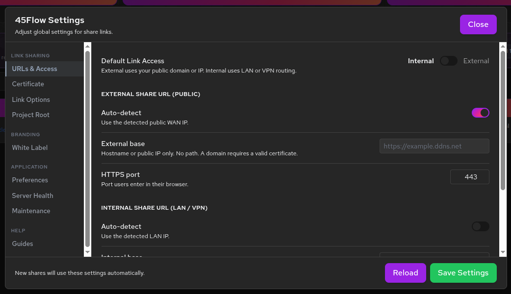

### URLs & Access

Toggle between **Internal** and **External** as the default network access mode for new links:

- **Internal** — New links default to LAN/VPN routing.
- **External** — New links default to public/internet routing (requires port forwarding).

**External Share URL (Public):**

| Setting | Description |
|---------|-------------|
| **Auto-detect (WAN IP)** | Enable to automatically detect and use your public IP address. Disable to enter a custom domain. |
| **External base** | Your public hostname or IP (e.g., `https://example.ddns.net`). No path — hostname only. |
| **External HTTPS port** | Port users will use in their browser. Default is `443`. |

> **Note:** Using a custom domain requires a valid SSL certificate for that domain. See [SSL Certificate Management](#ssl-certificate-management) below.

**Example:**  
Without a domain: `https://142.177.145.42/s/<token>`  
With a domain: `https://studio.yourcompany.com/s/<token>`

**Internal Share URL (LAN / VPN):**

| Setting | Description |
|---------|-------------|
| **Auto-detect (LAN IP)** | Enable to automatically detect and use your local server IP. |
| **Internal base** | Private IP or internal hostname (e.g., `http://192.168.1.123`). |

A **Preview** section shows the currently active external and internal URLs so you can verify your configuration.

### SSL Certificate Management

The **Certificate** tab lets you upgrade from the default self-signed certificate to a trusted **Let's Encrypt** certificate for your custom domain. A trusted certificate eliminates browser security warnings when clients open share links.


**Certificate Status:**

The top section shows your current certificate state:

| Field | Description |
|-------|-------------|
| **Type** | Self-Signed (default) or Trusted (Let's Encrypt) |
| **Domain** | The domain the certificate is issued for |
| **Expires** | Expiration date with days remaining |
| **Auto-renewal** | Whether automatic renewal is active (Let's Encrypt certificates auto-renew before expiry) |

**Setting Up a Trusted Certificate:**

1. **Configure your domain** — Enter your custom domain name (e.g., `studio.yourcompany.com`). This auto-syncs from the External Base if already set.
2. **Add a contact email** — Let's Encrypt sends renewal notices to this address.
3. **Create a DNS A record** — At your domain registrar (GoDaddy, Namecheap, Cloudflare, etc.), create an **A record** pointing your domain to your server's public IP address.
4. **Verify DNS** — Click **"Verify DNS"** to confirm the record is active.
5. **Install certificate** — Once DNS is verified, click **"Install Trusted Certificate"** to automatically obtain and install the Let's Encrypt certificate.

**Reverting to Self-Signed:**

If you need to remove the trusted certificate (e.g., domain change), click **"Revert to Self-Signed"**. This instantly switches back to the self-signed certificate.

> **Important:** Port 80 and 443 must both be accessible from the internet for Let's Encrypt validation to succeed. Ensure your firewall and port forwarding rules allow both ports.

### Link Options

These defaults are applied automatically when creating new links, but can be changed per link:

| Option | Description |
|--------|-------------|
| **Restrict access to users** | New links default to restricted (invited users only) mode. |
| **Allow comments on open links** | Enable comments by default on open (unauthenticated) links. **Pro feature only.** |
| **Generate review copies by default** | Automatically enable review copy generation for new links. |
| **Default watermark settings** | Configure default watermark image and settings for new links. See [Watermark Settings — Video and Image Support](#watermark-settings--video-and-image-support) for details on Community vs Pro watermark features. |

### Project Root

| Setting | Description |
|---------|-------------|
| **Ignore ZFS pools** | Check to skip the pool selection step and always use the configured project root. |
| **Project root path** | Absolute path used as the default starting directory when creating shares or uploads. |

### Preferences & Performance

**Display:**

| Option | Description |
|--------|-------------|
| **Time format** | Toggle between 24-hour and 12-hour time display throughout the app. |

**Performance:**

| Option | Description |
|--------|-------------|
| **Client-side transcoding** | When enabled, videos are processed on your computer before upload — using your local CPU or GPU. This creates review copies faster and reduces load on the server. When disabled, the server handles all video processing after files are uploaded. |
| **Hardware Acceleration** | Uses your GPU (NVIDIA NVENC, Intel Quick Sync, AMD AMF, Apple VideoToolbox) for faster transcoding. Falls back to CPU-only when no compatible GPU is detected. |
| **Encode Quality** | Choose between Fast (quicker encode, larger file), Balanced (good tradeoff), or Quality (slower encode, best visual fidelity). |
| **Detected Encoders** | Shows which hardware encoders passed verification on your system. |

#### Hardware Requirements for Client-side Transcoding

- **Minimum:** Any modern multi-core CPU (4+ cores recommended)
- **Recommended:** Dedicated GPU with hardware encoding support (NVIDIA GTX 1060+ / Intel 6th-gen+ / Apple Silicon)
- **Storage:** Temporary disk space equal to ~1.5× the size of the source video during transcode
- **FFmpeg** is bundled with 45Flow — no separate installation is needed

> **Tip:** If client-side transcoding fails (e.g., insufficient GPU memory or unsupported codec), you can disable it in Settings → Preferences. The server will handle transcoding instead — it just takes longer.

### Server Health

The **Server Health** section provides real-time resource statistics from your connected server.

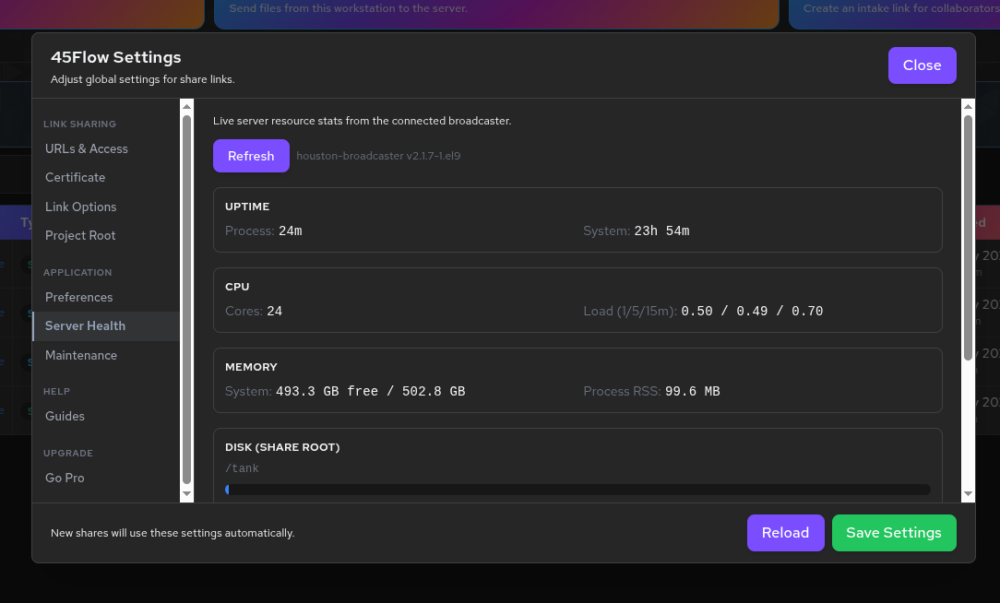

Server Health auto-loads when you navigate to the section and shows the following:

| Section | What It Shows |
|---------|---------------|
| **Version** | The installed houston-broadcaster version |
| **Uptime** | Process uptime (how long the server has been running) and system uptime (total OS uptime) |
| **CPU** | Number of CPU cores and load averages (1-minute, 5-minute, 15-minute) |
| **Memory** | System total/free RAM and process RSS (resident set size) |
| **Disk (Share Root)** | Visual progress bar showing disk usage on the share root volume, with used/free/total bytes |
| **Transcode Queue** | Number of transcode jobs currently queued, running, completed, or failed |
| **Links & Connections** | Count of active/total links and current WebSocket connections |

The disk usage bar changes color based on usage:
- 🔵 Blue — under 75% used
- 🟡 Amber — 75%–90% used
- 🔴 Red — over 90% used

Click **"Refresh"** to fetch the latest stats from the server.

> **Note:** Server Health requires admin (PAM) access. If you're logged in with a non-admin user or an environment token, you'll see an access denied message.

### Maintenance & Cleanup

For administrators to manage server health:

- **Delete orphan transcode directories** — Remove transcode output folders that no longer have associated links.
- **Prune DB rows for missing source files** — Clean up database entries where the original files no longer exist on disk.
- Configure **orphan min age** (hours) and **max missing file checks** to control scan scope.
- Click **"Run Scan"** to preview what would be cleaned, then **"Apply Cleanup"** to execute.
- Use **"Export JSON"** to save scan results.

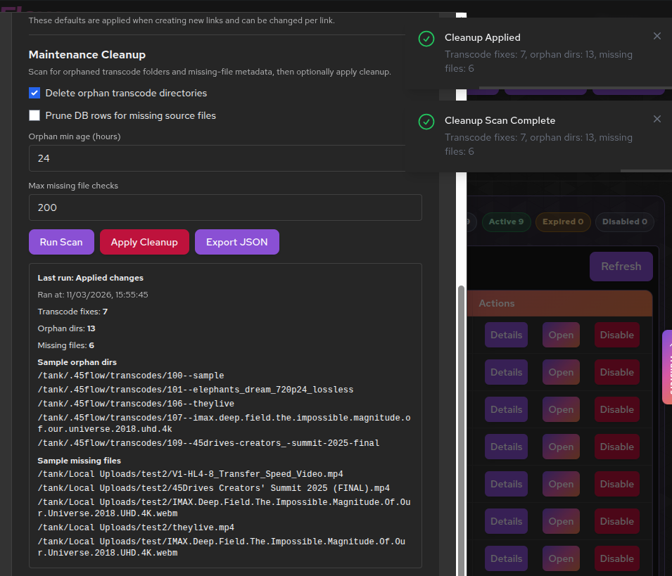

### Guides

The Guides section provides:

- **Open User Guide** — Opens this documentation in your browser.
- **Disable guided tours** — Turn off all onboarding walkthroughs and first-time guides.
- **Re-enable guided tours** — Reset onboarding walkthroughs so they show again on each page.

### Saving Settings

- Click **"Save settings"** to apply all changes. New links will use the updated defaults.
- Click **"Reload"** to discard changes and reload current settings from the server.

> **Important:** Settings changes affect only **newly created links**. Existing links are not modified retroactively.

### Go Pro — License Activation

The **Go Pro** section appears in Settings when your server is unlicensed or running on a trial license. Use this section to activate a full license or start a free trial.

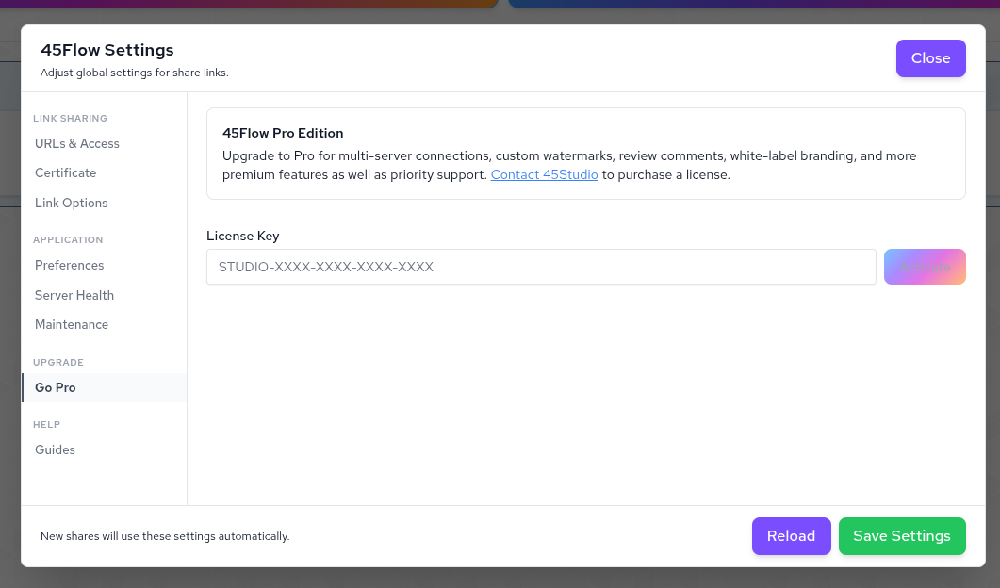

**License Activation:**

1. Enter your **License Key** in the input field.
2. Click **"Activate License"**.
3. The app validates your key with the licensing server.
4. On success, your server is permanently licensed and the app immediately upgrades to Pro mode.

**Start a Free Trial:**

If you don't have a license key yet:

1. Click **"Start Free Trial"**.
2. Enter your email address.
3. A 30-day trial license is generated and activated automatically.
4. You'll receive a confirmation email with trial details.

**Trial Status:**

When running on a trial license, this section shows:
- Trial expiration date
- Days remaining
- Option to upgrade to a full license before the trial expires

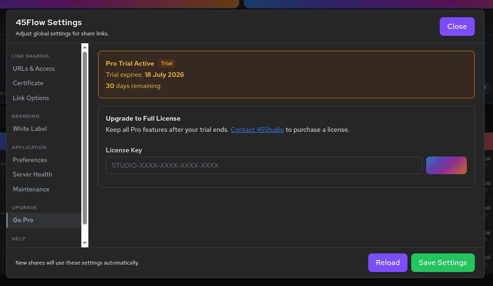

When a trial expires, the app reverts to Community mode and Pro features are disabled until a full license is activated.

> **Note:** The Go Pro section is hidden once your server is fully licensed. To check license status or manage your license, contact 45Drives support.

---

## 8. Custom Branding (White Label) — Pro Feature

**Custom branding requires a Pro license.** This feature lets you customize how share links, upload pages, and review pages appear to your clients and collaborators. When enabled, recipients see your company's branding instead of the default 45Flow identity.

Access branding configuration from **Settings → White Label**.

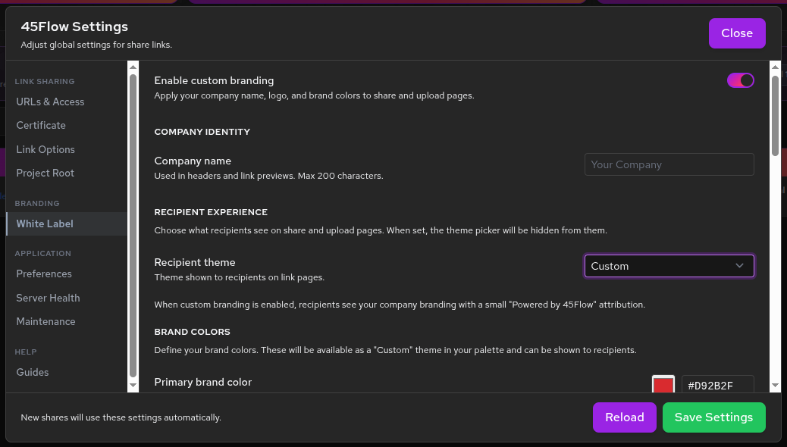

### Enabling Branding

Toggle the **"Enable white-label branding"** switch at the top of the Branding section. When disabled, all share pages display the default 45Flow branding.

### Company Identity

| Field | Description |
|-------|-------------|
| **Company name** | Your company or studio name (max 200 characters). Displayed on share pages below the logo. |

### Theme & Colors

Control the visual theme applied to all share/upload pages that recipients see:

**Enforced Theme:**

Choose from 22+ built-in themes or select **"Custom"** to define your own brand colors:

- **Built-in themes** — Pre-designed color palettes (dark, light, and specialty themes) applied automatically to all share pages.
- **Custom** — Define your own primary and secondary brand colors.

When **Custom** is selected, two color pickers appear:

| Field | Description |
|-------|-------------|
| **Primary color** | Main brand color used for buttons, links, and accent elements (e.g., `#D92B2F`). |
| **Secondary color** | Supporting color used for gradients, hover states, and secondary elements (e.g., `#b02428`). |

A **gradient preview** shows how your colors will render together. The editor also provides a **WCAG contrast warning** if your color combination may have accessibility issues with text readability.

> **Note:** When an enforced theme is set, recipients cannot change the theme on share pages — the theme picker is hidden from their view. This ensures consistent brand presentation.

### Company Logo

Upload your company logo to replace the default 45Flow logo on all share and upload pages.

| Option | Description |
|--------|-------------|
| **Default logo** | A single logo used for both light and dark backgrounds. Upload a PNG, JPEG, SVG, or WebP file (max 2 MB). |
| **Split logos (light/dark)** | Toggle to upload separate logos optimized for light and dark backgrounds. Useful when your logo doesn't work on both. |

After uploading, a preview shows the logo with its dimensions and file size. Click the **trash icon** to remove an uploaded logo.

> **Tip:** For best results, use a transparent PNG or SVG with adequate padding. Logos are displayed at a reasonable size — overly large images will be scaled down.

### Support & Contact Information

Add your company's support details to share pages, so recipients know who to contact:

| Field | Description |
|-------|-------------|
| **Support email** | Displayed as a clickable mailto link on share pages (max 200 characters). |
| **Support URL** | A link to your help desk, FAQ page, or support portal (max 500 characters). |

These appear on password-protected pages, expired link pages, and in the footer of upload pages.

### Link Preview Metadata

Customize how your share links appear when pasted into social media, Slack, Teams, email clients, or any platform that renders **Open Graph** (OG) previews:

| Field | Description |
|-------|-------------|
| **Link preview title** | The title shown in social cards and link unfurls (max 200 characters). |
| **Link preview description** | The description text shown below the title in link previews (max 500 characters). |

> **Example:** When someone pastes a share link into Slack, instead of showing "45Flow — Secure file sharing", it could show "Acme Studios — Review your project files securely".

### Live Preview

The branding panel includes a **live preview** section showing miniature mockups of how your branding will appear:

- **Protected Link page** — What recipients see when a link requires a password.
- **Review Page** — The video player / file viewer page.
- **Upload Page** — The drag-and-drop upload page.

These previews update in real-time as you change settings, giving you immediate visual feedback before saving.

### Clearing Branding

Click **"Clear branding"** at the bottom of the section to reset all branding fields to their defaults. This removes all custom logos, colors, company name, and support info — restoring the default 45Flow appearance on all share pages.

### How Branding Appears to Recipients

When branding is enabled, recipients viewing your share links will see:

- **Your logo** instead of the 45Flow logo (respects light/dark mode if split logos are configured)
- **Your company name** displayed below the logo
- **Your brand colors** applied to buttons, links, gradients, and backgrounds
- **Your support contact** on password pages and expired link pages
- **"Powered by 45Flow"** attribution shown as a subtle footer (required)
- **Your enforced theme** — recipients cannot change the color theme

> **Important:** Branding is tied to your server's license. If the license expires or is revoked, share pages will revert to default 45Flow branding.

---

## 9. Drag and Drop QuickShare

The **QuickShare** feature provides the fastest way to create a share link. Simply drag files from your desktop or file manager directly into 45Flow to instantly generate a shareable link with one click.

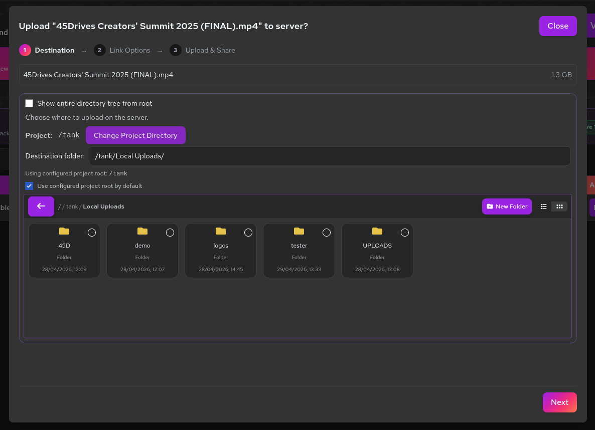

### How to Use QuickShare

1. **Drag Files:** From anywhere on your computer, drag one or more files directly into the QuickShare drop zone.
2. **Files Upload:** The selected files are automatically uploaded to your server.
3. **One-Click Share:** Once uploaded, click the **"QuickShare"** button to instantly generate a shareable link with default settings.

### QuickShare Link Settings

QuickShare links are created with the following default settings:

- **Expiration:** 7 days from creation
- **Access Mode:** Anyone with the link (no password required)
- **Network:** Local network access (LAN/VPN)
- **Comments:** Enabled by default

These defaults can be customized in [Settings](#6-settings) under **Default Link Options**.

### After Creating a QuickShare Link

Once generated, the share link is:
- **Automatically copied to your clipboard** — ready to paste into email, chat, or wherever you need
- **Displayed on screen** — for immediate viewing and verification
- **Added to your Active Links table** on the Dashboard for management

From the Dashboard, you can find your QuickShare link and:
- Edit settings (change expiration, access mode, etc.)
- Copy the link again
- View access logs
- Delete the link

> **Tip:** QuickShare is perfect for ad-hoc file sharing when you don't need custom settings. For more control over link configuration, use the [full file share workflow](#9-share-files-remotely-generate-a-share-link) instead.

---

## 10. Creating Links — Share, Upload, or Combined

45Flow uses a **unified link system** — every link can be configured to support file sharing (review/download), upload, or both simultaneously. You no longer need to create separate "share links" and "upload links" — a single link can do both.

Click **"New Link"** from the Dashboard to begin.

### Step 1: Select a Project or Destination

First, choose where the link will operate:

**For share links (or combined):**
- Select a **Project** if you're organizing links into projects.
- Or select a **ZFS pool** or **root directory** to browse the full filesystem.

**For upload-only links:**
- Choose the destination folder where uploaded files will be saved.

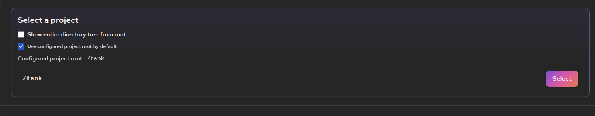

The screen displays your available **ZFS pools** (storage locations) such as `/media`, `/projects`, etc. Click **"Select"** next to the pool you want to use. Alternatively, check **"Show entire directory tree from root"** to browse the full filesystem.

> **Tip:** You can set a default project root in **Settings → Project Root** to skip this step for future links.

Click **"Return to Dashboard"** at any time to cancel.

### Step 2: Configure Link Settings

After choosing a location, you'll see the link configuration screen.


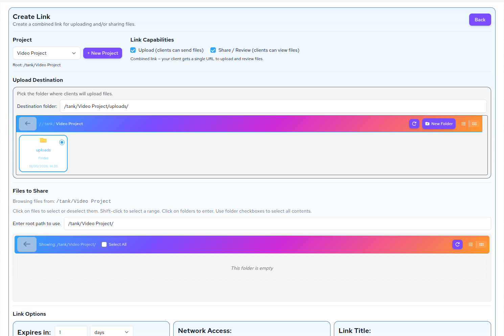

### Link Types — Share, Upload, Combined

45Flow links support three modes:

| Mode | Description |
|------|-------------|
| **Share only** | Recipients can view, download, and comment on files. You select which files to share. |
| **Upload only** | Recipients can upload files to a specified destination folder. No files are pre-selected. |
| **Combined (Share + Upload)** | Recipients can both review your shared files AND upload their own files to the same location. Perfect for collaborative workflows. |

Toggle **"Enable file sharing"** and **"Enable uploads"** to choose the link mode.

#### Selecting Files (Share Mode)

When file sharing is enabled:

- Use the **file browser** to navigate folders and select individual files or entire folders.
- Selected files appear in the **"Selected files"** panel with a count badge.
- Click **"Show list"** to review your selection, and use the **✕** button to remove individual files.
- Click **"Clear all"** to start over.

#### Configuring Basic Settings

**Expiration:**
- Set how long the link stays active using the **"Expires in"** field.
- Use the number and time unit (hours, days, weeks) or choose a quick preset: **1 hour**, **1 day**, **1 week**, or **Never**.
- Once expired, the link becomes inaccessible automatically.

**Network Access:**
- **Share Locally (Over LAN)** — Link accessible only within your local network or VPN.
- **Share Externally (Over Internet)** — Link accessible from anywhere. Requires port forwarding to be configured.
- Use the **"Check Port"** button to verify your external port forwarding is working.

**Link Title** (optional):
- Give the link an internal name to help you identify it later on the Dashboard.

**Project Assignment** (optional):
- Assign the link to a Project for organization. Select from the dropdown or leave unassigned.

### Link Access Modes

Choose who can access the link:

| Mode | Description |
|------|-------------|
| **Anyone with the link** | No login required. Anyone with the URL can access the files. You can optionally enable the **"Allow comments"** toggle so visitors can leave a name and comment. |
| **Anyone with the link + password** | Requires a shared password. Enter a password in the field that appears. The same password is used by all recipients. |
| **Only invited users** | Requires each user to log in with their own credentials. Click **"Invite users…"** to select which users can access. Permissions are controlled by their assigned roles. |

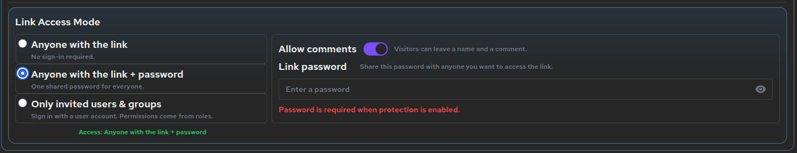

### Advanced Video Options

When sharing video files, expand the **"Advanced video options"** section for additional controls:

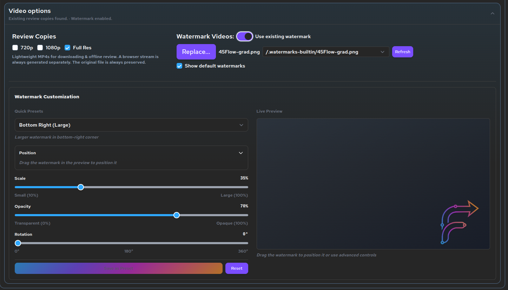

**Use Review Copies:**
- When enabled, the system generates lower-resolution review copy versions of your videos (720p, 1080p).
- Shared links serve the review copies instead of the originals, providing faster playback and reduced bandwidth.
- Select which qualities to generate: **720p**, **1080p**, **Original**, or any combination.

### Watermark Settings — Video and Image Support

45Flow supports watermarking for both **video files** and **image files**. When enabled, watermarks are applied to review copies (for videos) or directly to the shared image (for images).

**Enable Watermark:**
- Toggle **"Apply watermark"** to enable watermarking.
- Upload a watermark image or choose from built-in presets.

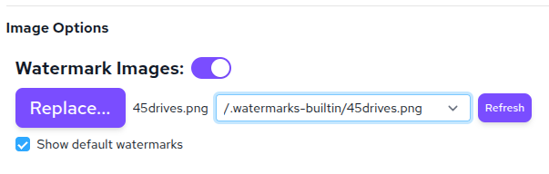

**Community vs Pro Watermarking:**

| Feature | Community | Pro |
|---------|-----------|-----|
| Enable/disable watermark | ✅ Yes | ✅ Yes |
| Select watermark image | ✅ Yes | ✅ Yes |
| Position control (9 anchor points) | ❌ Bottom-right only | ✅ Full control |
| Scale, opacity, rotation | ❌ Fixed | ✅ Customizable |
| Watermark presets | ❌ No | ✅ Yes |
| Image watermarking | ✅ Yes | ✅ Yes |

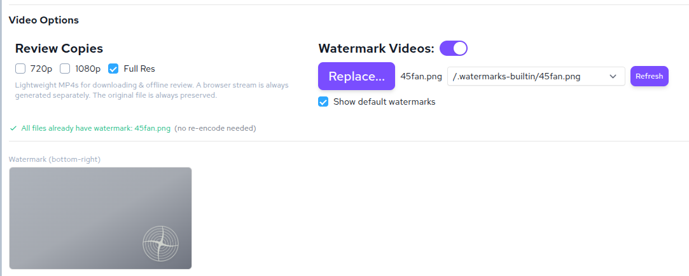

**Watermark Position & Style (Pro):**

| Setting | Description |
|---------|-------------|
| **Position** | Nine anchor points: Top-Left, Top-Center, Top-Right, Center-Left, Center, Center-Right, Bottom-Left, Bottom-Center, Bottom-Right. |
| **Scale** | Size of the watermark relative to the frame (percentage). |
| **Opacity** | Transparency level (0% = invisible, 100% = fully opaque). |
| **Rotation** | Angle in degrees (e.g., 45° for diagonal placement). |

**Watermark Presets (Pro):**

- The preset dropdown shows all available watermark images with saved settings.
- Select a preset to instantly apply a predefined watermark configuration.
- Upload your own watermark image by clicking **"Upload custom watermark"**.
- Presets can be saved and reused across multiple links.

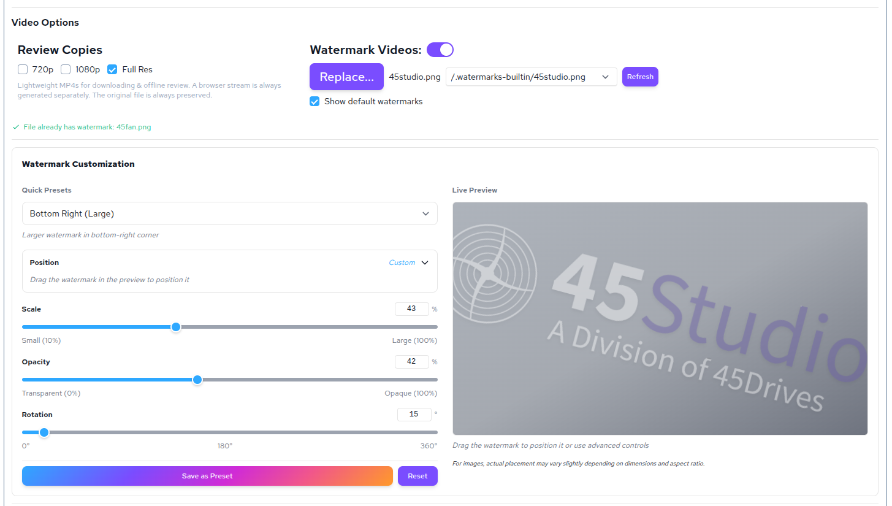

> **Note:** In Community mode, watermarks are applied to videos only, fixed at bottom-right position with default scale/opacity. Upgrade to Pro for full customization.

### Generating the Link

1. Verify all your settings are correct.
2. Click **"Generate Flow link"**.
3. The generated URL will appear — use the **"Copy"** button to copy it to your clipboard, or **"Open"** to view it in your browser.
4. The link is now visible on your Dashboard for ongoing management.

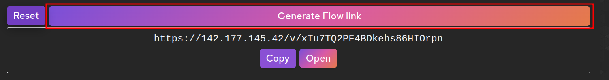

---

## 10. Upload Files Locally

Use this feature to transfer files from your workstation directly to the server. This is ideal for getting new media onto the server for sharing later.

Click **"Upload Files Locally"** from the Dashboard to begin. A three-step wizard will guide you through the process.

### Step 1: Select Local Files


1. Click **"Choose Files"** to select individual files, or **"Choose Folder"** to add an entire folder's contents.
2. Selected files appear in a table showing **Name**, **Size**, and a **Remove** button.
3. A summary shows the total number of items and combined size.
4. Use **"Clear"** to remove all selected files and start over.
5. Click **"Next"** to proceed.

> **Note:** You can select multiple files at once in the file chooser dialog.

### Step 2: Choose Destination


1. Select a **ZFS pool** (storage location) or check **"Show entire directory tree from root"** for full filesystem access.
2. Navigate the folder browser:
   - **Single-click** a folder to select it as the destination.
   - **Double-click** a folder to enter it and browse deeper.
   - Click **"New Folder"** to create a new directory at the current location.
3. The selected destination path is shown at the top.
4. Click **"Change Project Directory"** to go back and select a different pool.
5. Click **"Next"** to proceed, or **"Back"** to return to file selection.

### Step 3: Upload & Monitor Progress

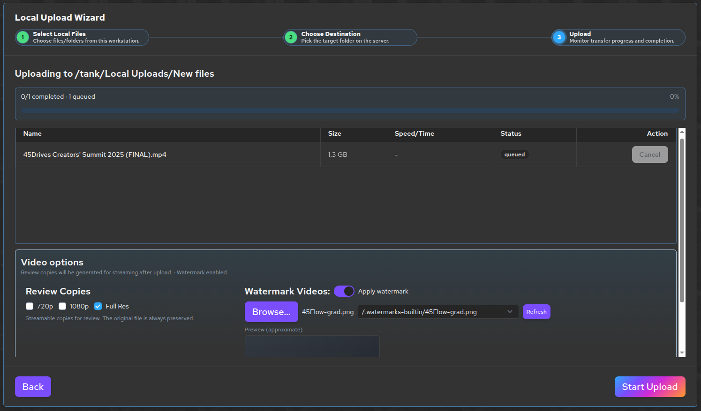

**Before Uploading:**

If you're uploading video or image files, you can configure **Advanced Options** before starting:

- **Use Review Copies** — Enable to generate review copy versions (720p, 1080p) of your videos during upload. These review copies are used when you share the files later via links.
- **Watermark Media** — Apply a watermark overlay to uploaded videos and images (Pro: images supported with full customization; Community: videos only with basic positioning).

Click **"Start Upload"** to begin transferring files.

**During Upload:**

The upload table shows each file with real-time status:

| Column | Description |
|--------|-------------|
| **Name** | File name with upload percentage |
| **Size** | File size |
| **Speed / Time** | Transfer speed during upload, or total time after completion |
| **Status** | Current state — **Queued**, **Transcoding** (local), **Uploading**, **Done**, **Canceled**, or **Error** |
| **Action** | Cancel button (available during active transcode or upload) |

A progress bar at the top shows overall completion across all files.

When **client-side transcoding** is enabled (Settings → Performance), video files go through a two-phase workflow:
1. **Transcode** — The video is processed on your machine (shown as "Transcode XX%")
2. **Upload** — The processed file is transferred to the server (shown as "Upload XX%")

This offloads video processing from the server to your workstation. If you don't have client-side transcoding enabled, the server handles video processing after upload.


**After Upload:**

When all files are complete, click **"Finish"** to return to the Dashboard.

> **Tip:** If any uploads fail, the error message will appear below the file entry. You can address the issue and re-upload those files.

---

## 12. Transfer Dock

The **Transfer Dock** is a persistent overlay that tracks all active and recently completed transfers — uploads, transcodes, and review copy generation. It remains visible across all screens so you can continue working while monitoring progress.

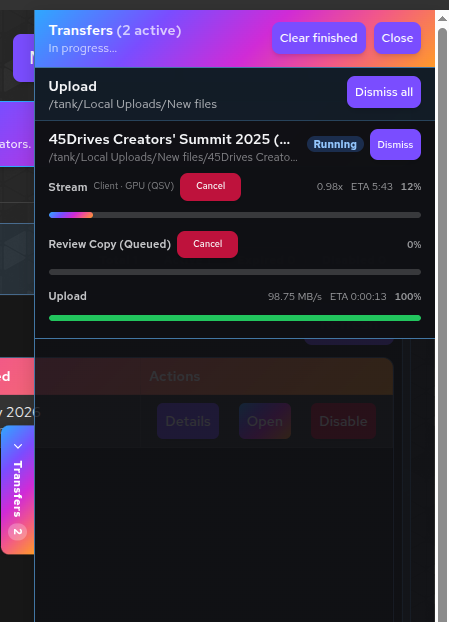

### Transfer Dock Overview

The Transfer Dock appears at the bottom of the screen whenever a transfer is in progress. It shows:

- **Active transfer count** — e.g., "Transfers (2 active)"
- **Link grouping** — Transfers are grouped by the link they belong to, with the server name and link URL displayed.
- **Clear finished** — Remove completed transfers from the dock.
- **Close** — Collapse the dock (transfers continue in the background).

When collapsed, a minimal indicator remains visible showing active transfer count. Click it to expand the dock again.

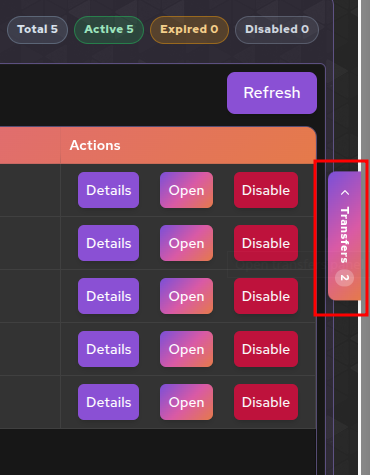

### Transfer Entry Details

Each file in the Transfer Dock shows:

| Field | Description |
|-------|-------------|
| **File name** | The name of the file being transferred. |
| **Destination** | Server-side path (e.g., `tank/Local Uploads/video.mp4`). |
| **Status** | Current state: *Running*, *Complete*, *Queued*, *Canceled*, or *Error*. |
| **Progress** | Percentage bar for the active phase. |
| **Speed** | Transfer or encode speed (e.g., `95.23 MB/s` for uploads, `1.05x` for transcodes). |
| **ETA** | Estimated time remaining. |
| **Action** | Cancel or Dismiss button. |

### Transcode Status

When review copies or streaming proxies are being generated, each transcode entry shows:

- **Transcode source** — `Client` or `Server`, indicating where the processing is running.
- **Encoder** — The hardware/software encoder in use:
  - `GPU (QSV)` — Intel Quick Sync Video
  - `GPU (NVENC)` — NVIDIA hardware encoder
  - `GPU (AMF)` — AMD hardware encoder
  - `GPU (VideoToolbox)` — macOS hardware encoder
  - `CPU` — Software encoding (libx264)
- **Speed multiplier** — e.g., `1.05x` means encoding at 1.05× real-time.
- **Progress** — Percentage complete with ETA.

A typical transfer entry for a QuickShare might show multiple sub-items:

```
Review Copy (Full Res)     Client · GPU (QSV)    1.05x   ETA 2:08   31%
Stream                     Client · GPU (QSV)    100%
Upload                     95.23 MB/s            ETA 0:14            100%
```

> **Tip:** If client-side transcoding is enabled (Settings → Performance), video processing happens on your machine before upload. The Transfer Dock shows both the transcode and upload phases separately so you can track each step.

---

## 13. Managing Links

All links you create — whether Share, Upload, or Combined — appear on the Dashboard in the **links table**. This is your central view for monitoring and managing all active, expired, and disabled links.


### Searching & Filtering Links

At the top of the table:

- **Search bar** — Filter links by title, directory, or file name. Results update as you type.
- **Type filter** — Show only specific link types: *All types*, *Upload*, *Share*, or *Combined*.
- **Status filter** — Show only links with a specific status: *All status*, *Active*, *Expired*, or *Disabled*.
- **Refresh** — Manually reload the link list from the server.

Summary badges show the count of **Total**, **Active**, **Expired**, and **Disabled** links.

### Link Table Columns

| Column | Description |
|--------|-------------|
| **Title** | Internal name of the link. Click the edit icon to rename it inline. Click the title to open Link Details. |
| **Type** | Badge showing **Upload**, **Share**, or **Combined** (share + upload enabled). |
| **Link** | The public URL. Click to open in browser, or use the **Copy** button. |

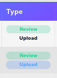
| **Expires** | Time remaining (e.g., *23 Hours*, *6d 22h*, *Never*). Shown in red when less than 24 hours remain. Click **Edit** to change the expiration. |
| **Status** | Current state: **ACTIVE** (green), **EXPIRED** (amber), or **DISABLED** (gray). |
| **Access** | Access mode: **Open** (green), **Password** (amber), or **Users only** (rose). Hover for details. |
| **Created** | Date and time the link was created. |
| **Actions** | Action buttons (see below). |

### Link Actions

Each link row provides these actions:

| Action | Description |
|--------|-------------|
| **Details** | Opens the full Link Details view with configuration, activity log, and file list. |
| **Open** | Opens the link in your browser to preview what recipients will see. |
| **Disable / Enable** | Immediately deactivates or reactivates the link. Disabling blocks access without deleting the link. |

---

## 14. Link Details

Click **"Details"** on any link (or click its title) to view comprehensive information.

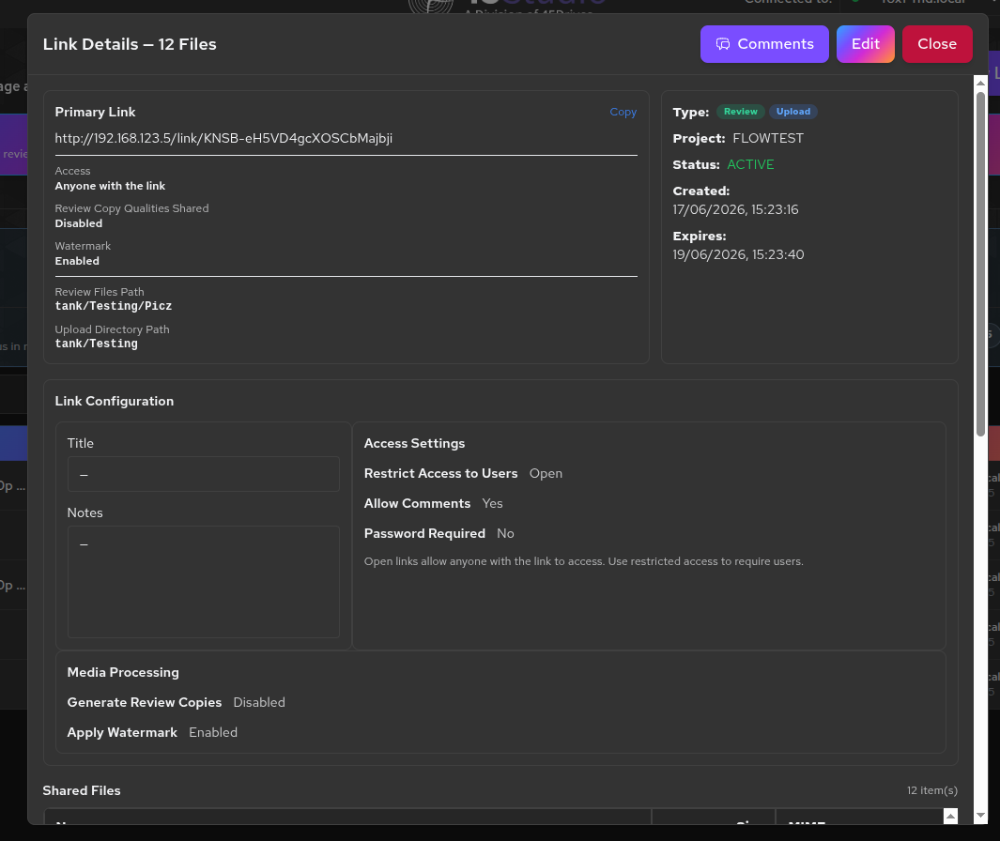

### Link Configuration Summary

The details view displays:

| Field | Description |
|-------|-------------|
| **Primary Link** | The full URL with a **Copy** button. |
| **Access** | Current access mode (Open / Password / Users only). |
| **Review Copies** | Whether review copy generation is enabled or disabled. |
| **Watermark** | Whether watermarking is enabled or disabled (shows "Video + Image" for Pro, "Video only" for Community). |
| **Type** | Share, Upload, or Combined. |
| **Status** | Active, Expired, or Disabled. |
| **Created** | Creation date and time. |
| **Expires** | Expiration date/time or "Never". |
| **Title** | Internal name. |
| **Project** | Associated project (if assigned). |
| **Notes** | Optional internal notes. |

### Shared Files

A table of all files associated with this link, showing:
- **Name** — File name
- **Size** — File size
- **MIME** — File type (e.g., video/mp4, image/jpeg)

### Access Activity Log

View a log of all actions taken on this link:

| Column | Description |
|--------|-------------|
| **When** | Date and time of the activity. |
| **Action** | What happened — e.g., *Playback requested*, *Download*, *Upload*, *Expiry updated*. |
| **Actor** | Whether the access was from a *Guest* or an *Authenticated user*. |
| **Source** | IP address and browser information. |
| **Summary** | Details of the action performed. |


### File Versions

If file versioning/snapshots are available, this section shows:

| Column | Description |
|--------|-------------|
| **Version** | Version identifier (e.g., v1, v2). |
| **Created** | When the version was created. |
| **Snapshot** | Snapshot reference. |
| **Size** | File size at that version. |
| **Restore** | Restore this version, replacing the current file. |
| **Delete** | Remove this version (if permitted). |

### Comments Review & Export

From the Link Details view, click the **"Comments"** button to review and manage all comments on a link.

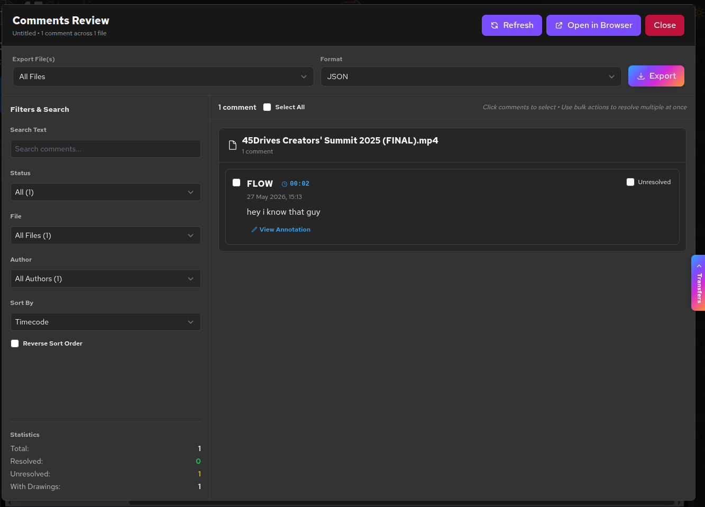

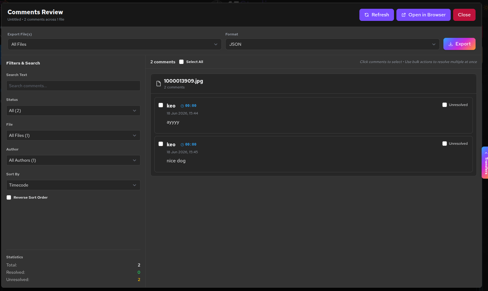

**Reviewing Comments:**

- View all comments across all files in a link in one place.
- **Filter** by file, by resolved/unresolved status, or by user.
- **Resolve/Unresolve** individual comments or bulk-resolve all.
- Each comment shows its timecode, author, annotation indicator, and tags.
- If a comment has an annotation, click **"View Annotation"** to see the drawing overlaid on the video frame at that timecode.

**Exporting Comments:**

Export comments in multiple formats for use in external tools:

| Format | Description |
|--------|-------------|
| **JSON** | Structured data with all fields — timestamps, authors, annotations, tags, resolved status. |
| **CSV** | Spreadsheet-compatible tabular export. |
| **Markdown** | Human-readable formatted list, suitable for reports or emails. |
| **WebVTT** | Subtitle/caption format — timecoded comments as VTT cues for use in NLEs or other players. |

Click **"Edit"** at the top of the Link Details view to modify the link's settings (see next section).

---

## 15. Editing a Link

From the Link Details view, click **"Edit"** to modify an existing link's configuration.

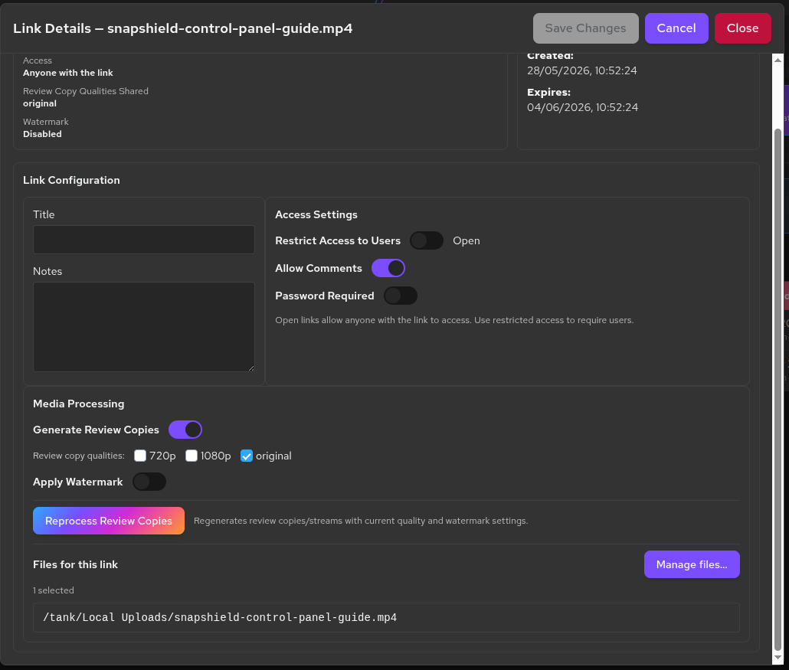

You can modify:

- **Title** and **Notes** — Update the internal name and documentation.
- **Project Assignment** — Assign or change the project this link belongs to.
- **Link Type** — Toggle "Enable file sharing" and "Enable uploads" to change between Share, Upload, or Combined mode.
- **Restrict Access to Users** — Toggle between open and restricted access.
- **Allow Comments** — Enable or disable commenting on shared files (Pro feature).
- **Password Required** — Enable or disable password protection, and set the password.
- **Generate Review Copies** — Enable/disable review copy generation and select qualities (720p, 1080p, Original).
- **Apply Watermark** — Enable/disable watermark overlay with full customization controls (position, scale, opacity, rotation, presets — Pro for full control).
- **Files for This Link** — Add or remove files associated with the link using **"Manage Files"**.

Click **"Save Changes"** to apply. All changes take effect **immediately**.

Click **"Cancel"** or **"Close"** to discard changes and return to Link Details.

> **Important:** Changes to access settings, passwords, and file lists take effect immediately for anyone accessing the link.

---

## 16. Accessing a Shared Link

When someone opens a share link you've created, their experience depends on the **access mode** you configured. This section explains what recipients see when accessing links with different restriction levels.

### Opening the Link

For **open access** (Anyone with the link) share links, recipients can immediately browse files, play videos, or download content without any login or password.

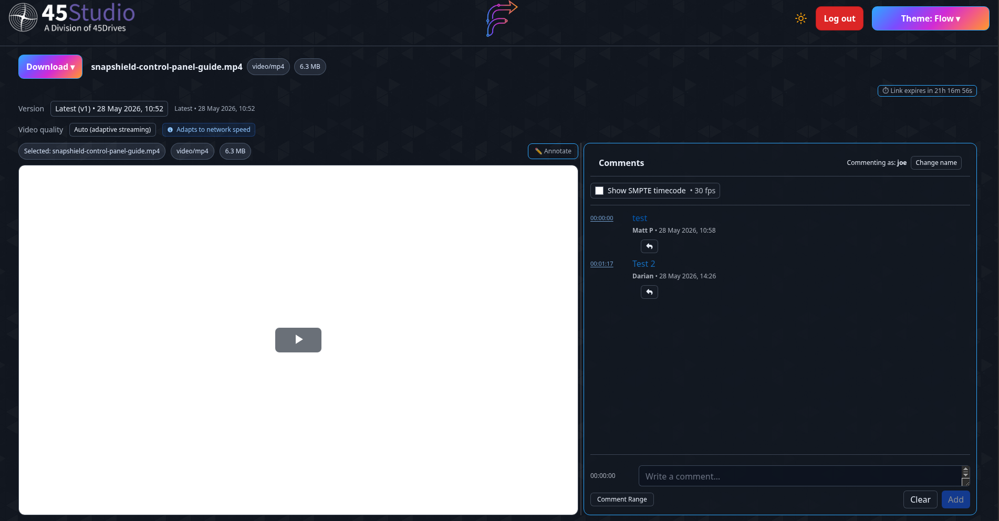

### Password-Protected Links

When you protect a link with a password (**Anyone with the link + password**), recipients must enter the correct password before accessing the content.

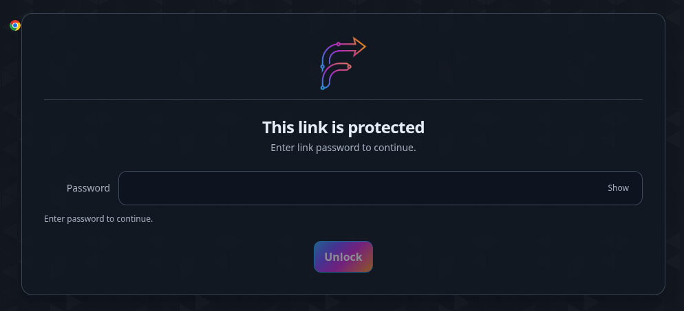

After entering the correct password, they'll have full access to the shared files according to the permissions you set (view, download, comment, etc.).

### User-Restricted Links

For links restricted to **specific users** or **invited users only**, recipients must log in with their credentials:

1. Click **"Sign In"** on the access screen.
2. Enter their username and password.
3. If authenticated and authorized, they'll be granted access to the content.

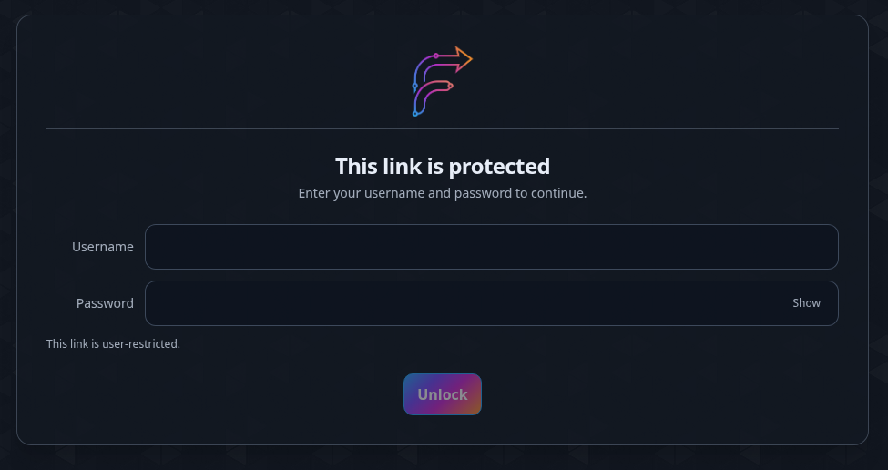

> **Note:** Users must have been invited to the link (or have appropriate role permissions) to access user-restricted content. See [User Management](#18-user-management) for details on creating and managing user accounts.

---

## 17. Video Player, Comments & Annotations

When someone opens a share link containing video files, they see the **45Flow Video Player** — a browser-based player with collaboration features.


### Playback Controls

The player supports standard media controls:
- **Play / Pause**
- **Seek bar** with timeline scrubbing
- **Volume control**
- **Fullscreen** toggle
- **Playback rate** adjustment (speed up or slow down)

### Quality Selection

If review copies were generated, viewers can choose their preferred quality:
- **Auto** — Automatically adapts to available bandwidth
- **720p** — Lower resolution, faster loading
- **1080p** — Full HD
- **Original** — Full quality source file (if included)

The player uses **HLS (HTTP Live Streaming)** for adaptive bitrate delivery.

### Timecoded Comments

If comments are enabled on the link, a **Comments Panel** appears alongside the player:

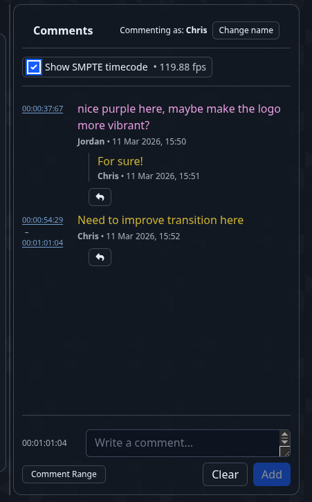

- **Viewing comments:** Comments are displayed with the author's name, timecode, and color-coded indicator. Click a timecode to jump to that point in the video.
- **Adding comments:** Click the comment input area, type your message, and submit. The comment is automatically tagged to the current playback position.
- **Replies:** Click on any comment to reply, creating threaded conversations.
- **Timecode markers:** Visual markers appear on the seek bar indicating where comments exist.
- **SMPTE timecodes:** Comments display professional SMPTE timecodes (HH:MM:SS:FF) when the video's frame rate is detected.

> **Note:** Commenting availability depends on the link's access mode and whether comments were enabled when creating the link.

### Annotations & Drawing Tools

**Pro Feature.** 45Flow includes built-in annotation tools for drawing directly on video frames. Annotations are created alongside comments in the review player.

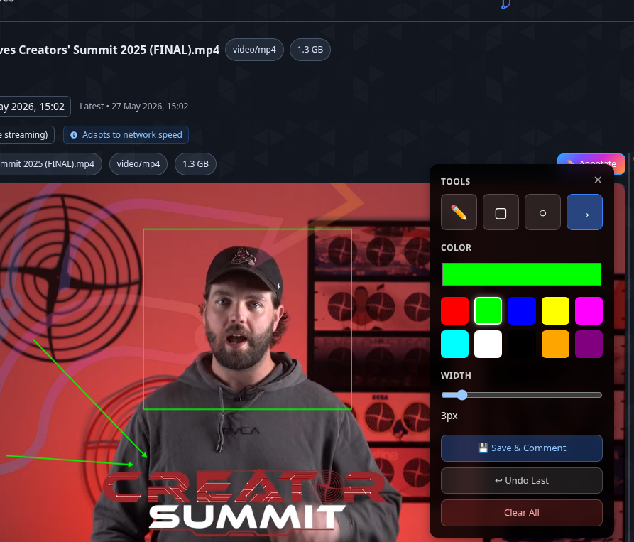

**Creating Annotations:**

1. Pause the video at the frame you want to annotate.
2. Click the **annotation/draw tool** in the comment area.
3. Use the available tools:
   - **Freehand** — Draw freeform paths
   - **Rectangle** — Draw rectangular highlights
   - **Circle/Ellipse** — Draw circular highlights
   - **Arrow/Line** — Draw directional arrows or straight lines
4. Choose a color for your annotation.
5. Submit the comment — the annotation is saved alongside the timecoded comment.

**Viewing Annotations:**

- **In the review player** — Navigate to a comment with an annotation and the drawing renders on top of the video at the correct timecode.
- **In Link Details → Comments** — Click **"View Annotation"** on any comment that has one. The **Annotation Viewer** modal shows a full-size view of the annotated frame with all drawing data rendered.

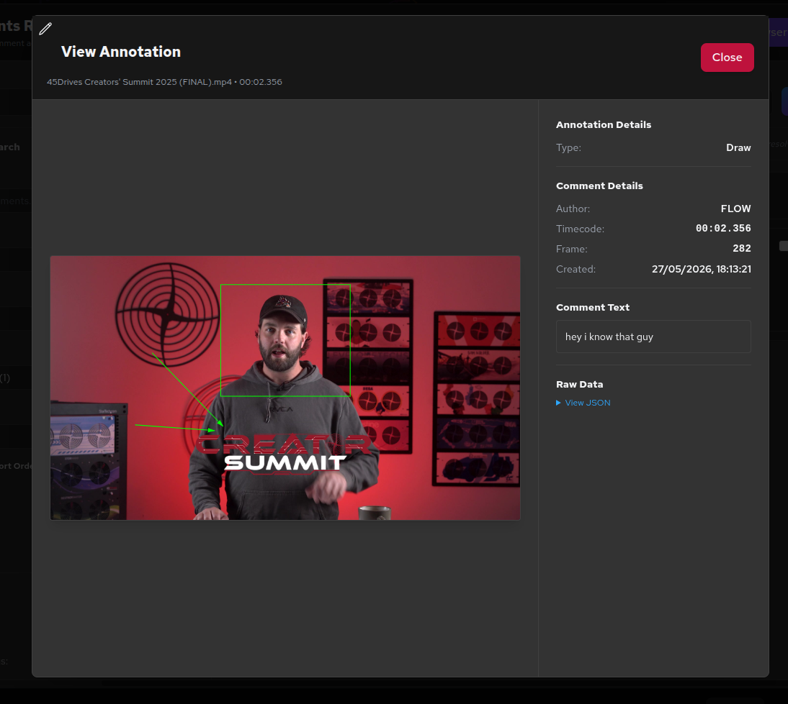

### Multi-File Shares

For collection links (multiple files), a sidebar file browser appears on the left. Click any file to load it in the player. Version selection is available if multiple versions exist.

---

## 18. User Management

Users are required for the **"Only invited users"** access mode and allow role-based permissions on restricted links. Access user management from the Dashboard by clicking **"Manage Users"**.

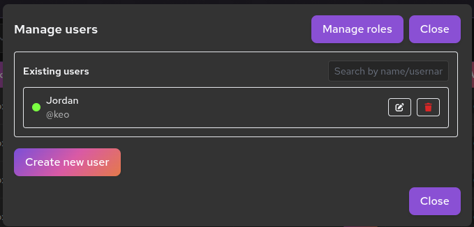

### Viewing Existing Users

The top section lists all currently created users with:
- **Name** and **Username**
- **Email** (if provided)
- **Company** and **Tags** (if provided)
- **Assigned role**
- **Color dot** indicating their comment color

Use the **search bar** to filter users by name, username, email, company, or tags.

### Creating a New User

Click **"Create new user"** to expand the creation form.

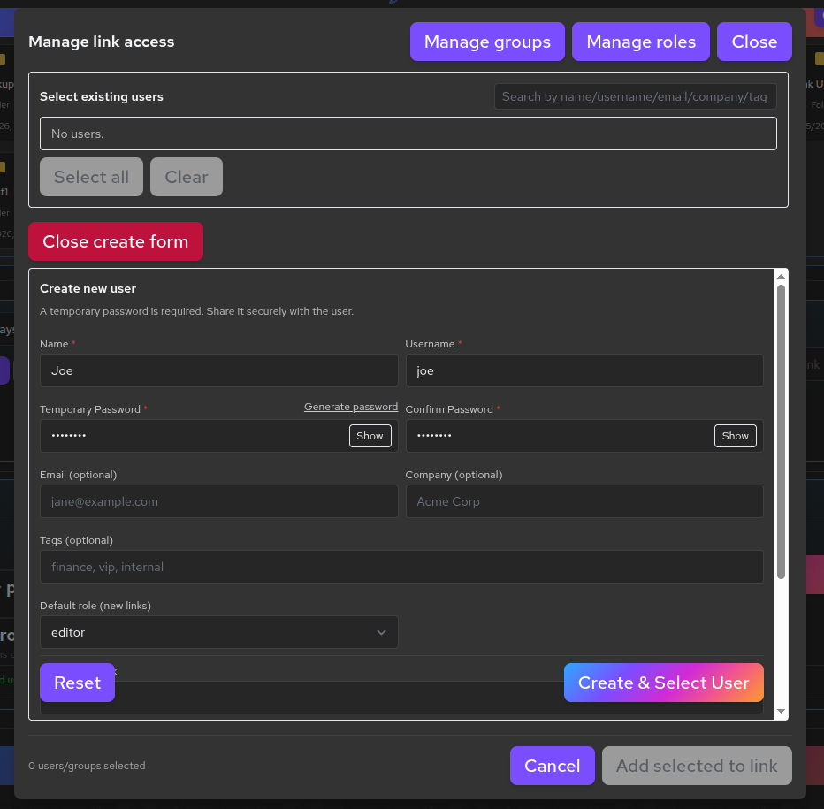

| Field | Required | Description |
|-------|----------|-------------|
| **Name** | Yes | Display name shown in comments and activity logs. |
| **Username** | Yes | Login identifier. Must be unique. |
| **Temporary Password** | Yes | Initial password (4–64 characters). Click **"Generate password"** to auto-generate one. Share this securely with the user. |
| **Confirm Password** | Yes | Must match the temporary password. |
| **Email** | No | Email address for identification. |
| **Company** | No | Company affiliation. |
| **Tags** | No | Comma-separated tags (e.g., `finance, vip, internal`). |
| **Default Role** | — | The role automatically assigned when this user is added to restricted links. |
| **Comment Color** | — | Hex color used to visually distinguish this user's comments. Use the color picker or type a hex value (e.g., `#94ebc8`). |

Click **"Create User"** to save. The user will appear in the existing users list and can now be invited to restricted links.

### Managing Groups

Groups allow you to organize users into logical collections (e.g., **Editors**, **Clients**, **Reviewers**) for easier permission management.

**Creating a Group:**

1. Click **"Create Group"** in the User Management screen.
2. Enter a **group name** and optional **description**.
3. Click **"Save"**.

**Adding Users to a Group:**

1. Open the group's detail view.
2. Click **"Add Users"**.
3. Select users from the list and confirm.

**Using Groups for Link Access:**

When creating a user-restricted link, you can invite an entire group instead of adding users individually. All group members will automatically have access to the link.

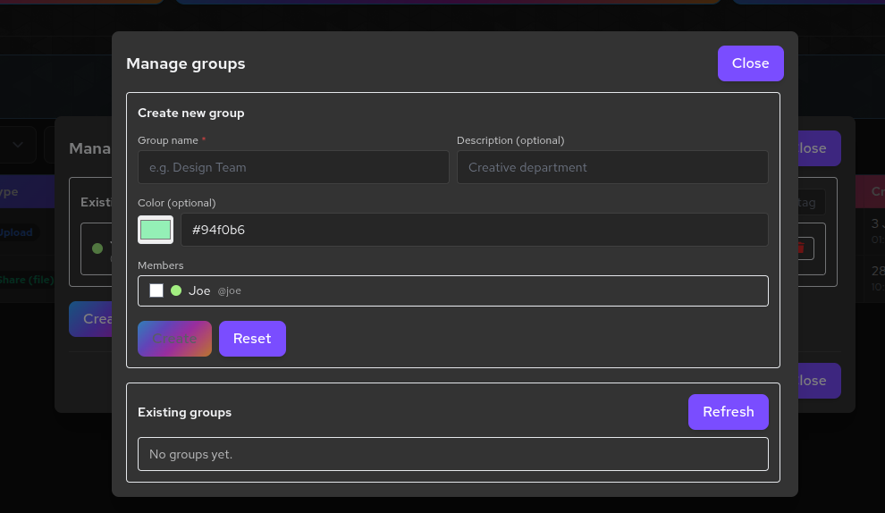

> **Tip:** Use groups to streamline link permissions when sharing with the same team repeatedly. Add new members to the group once, and they'll inherit access to all links shared with that group.

### Editing & Deleting Users

- Click the **pencil icon** on any user to edit their name, email, company, tags, comment color, default role, or to reset their password.
- Click the **red X** to delete a user. A confirmation dialog will appear — **this action cannot be undone**.

---

## 19. Role Management

Roles define what users can do when accessing restricted links. Access role management from **Manage Users → Manage Roles**.


### System Roles

45Flow includes three built-in roles that cannot be deleted:

| Role | View | Comment | Download | Upload |
|------|------|---------|----------|--------|
| **Editor** | ✅ | ✅ | ✅ | ✅ |
| **Feedback** | ✅ | ✅ | ✅ | ❌ |
| **Viewer** | ✅ | ❌ | ❌ | ❌ |

### Permission Definitions

| Permission | What It Allows |
|------------|----------------|
| **View** | See files, open media, browse directory contents |
| **Comment** | Leave timecoded comments and participate in threads |
| **Download** | Download files to their device |
| **Upload** | Upload files (on upload-enabled links) |

### Creating Custom Roles

1. Enter a **Role name** (e.g., "Client", "Uploader").
2. Check the permissions you want to grant.
3. Click **"Create"**.

### Editing & Deleting Roles

- Click **Edit** on any custom role to modify its name or permissions, then click **Save**.
- Click **Delete** to remove a custom role (only if it's not currently assigned to users).
- System roles (Editor, Feedback, Viewer) cannot be deleted or modified.

> **Important:** Role changes apply immediately to all users assigned that role. Removing a permission instantly restricts affected users.

---

## 20. Multi-Server Management

45Flow supports connecting to and managing **multiple servers** simultaneously.

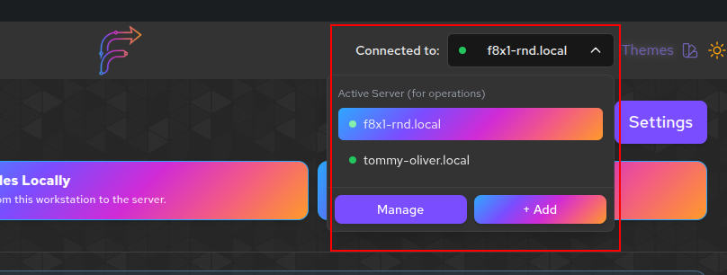

### Adding Servers

1. From the connection screen, connect to any server using auto-discovery or manual IP.
2. Once connected, use the **Connection Manager** (accessible from the server switcher dropdown in the header) to add additional servers.
3. Each server maintains its own JWT token, SSH credentials, and license status.

### Switching Active Server

The **active server** is displayed in the header bar. Click the dropdown to switch between connected servers. The active server is where all your actions take effect — creating links, uploading files, managing users, etc.

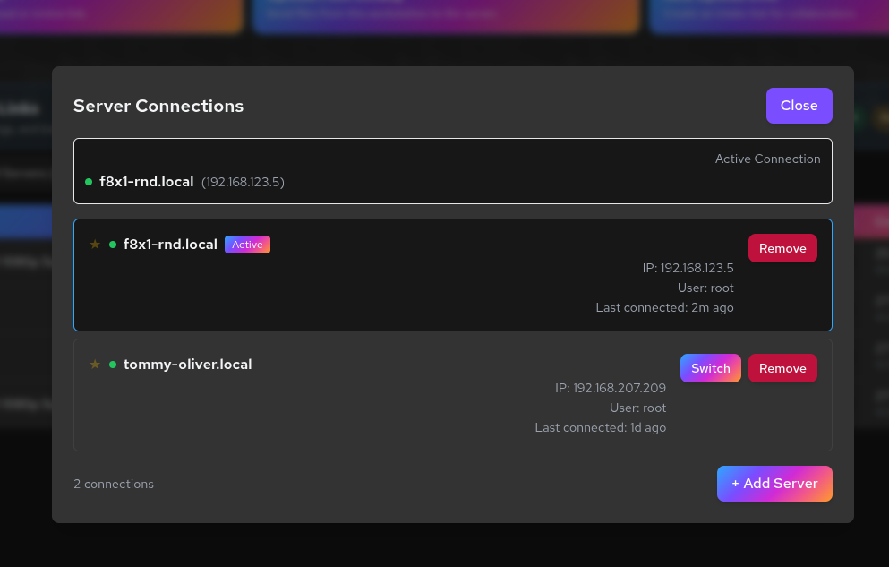

### Server Filter (All Servers View)

When multiple servers are connected, the **"Show links from"** filter appears on the Dashboard:

- **All Servers** — Aggregates links from every connected server. Each row shows which server the link belongs to.
- **Specific server** — Shows links only from the selected server.

This is useful for managing links across multiple servers from a single view.

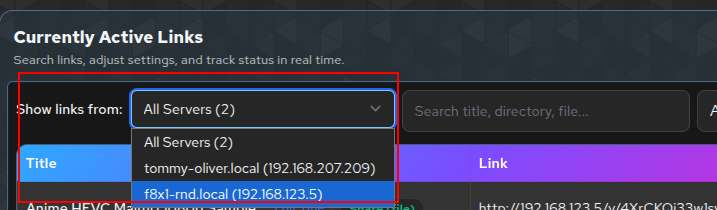

---

## 21. Automatic Updates

45Flow includes built-in automatic update detection and installation. When a new version is available, a banner appears at the top of the application window.

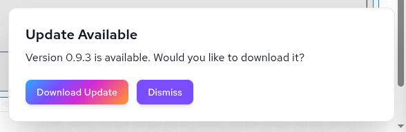

### Update Notifications

When a new version is detected:

1. An **update banner** appears showing the new version number.
2. Click **"Download"** to begin downloading the update in the background.
3. A progress indicator shows the download status.

> **Note:** Updates are checked automatically on launch and periodically while the app is running. No manual check is needed.

### Downloading & Installing Updates

Once the download completes, the banner changes to show an **"Install & Restart"** button:

- **macOS and Windows:** Click **"Install & Restart"** to quit the app, apply the update, and relaunch automatically.
- **AppImage (Linux):** Click **"Install & Restart"** — the AppImage self-updates in place and relaunches.

The update process is quick (typically a few seconds) and preserves all your settings and server connections.

### Linux Package Updates

On Linux systems using `.deb` or `.rpm` packages, automatic installation requires administrator privileges. Instead of auto-installing, 45Flow shows **manual installation instructions**:

1. The update is downloaded to your Downloads folder.
2. A yellow instruction box shows the exact command to run:
   - **Debian/Ubuntu:** `sudo apt install /path/to/45Flow-x.x.x-linux-amd64.deb`
   - **RHEL/Rocky/Fedora:** `sudo dnf install /path/to/45Flow-x.x.x-linux-x86_64.rpm`
3. Open a terminal, paste the command, and enter your password.
4. Relaunch 45Flow after the package is installed.

> **Tip:** Using `apt install` or `dnf install` (instead of `dpkg -i` or `rpm -Uvh`) ensures that dependencies are resolved automatically.

---

## 22. View Logs

The Log Viewer lets you inspect application activity, identify errors, and troubleshoot issues. Access it from the Dashboard by clicking **"View Logs"**.

The Log Viewer has two tabs: **Client Logs** and **Server Logs**.

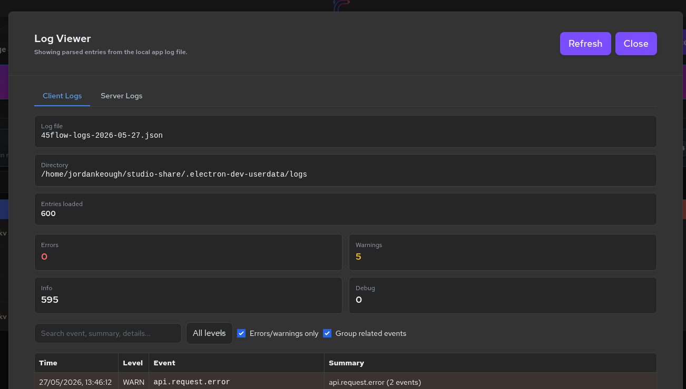

### Client Logs

The Client Logs tab shows parsed entries from the local application log file stored on your computer.

At the top, you'll see:

- **Log file** — The name of the currently loaded log file (e.g., `45flow-premium-client-2026-05-27.json`).
- **Directory** — The file path where logs are stored on your system.
- **Entries loaded** — Total number of parsed log entries.

**Severity counts** are shown as colored badges:
- 🔴 **Errors** — Failures, unhandled exceptions, critical issues
- 🟡 **Warnings** — Non-critical issues, network retries
- 🔵 **Info** — General operational events (uploads started, links created)
- ⚪ **Debug** — Low-level diagnostic data

### Server Logs (Audit Log)

The Server Logs tab retrieves structured audit log entries from the connected server. These entries record every significant action taken on the server — link creation, file changes, transcode operations, user actions, branding updates, license activations, and more.

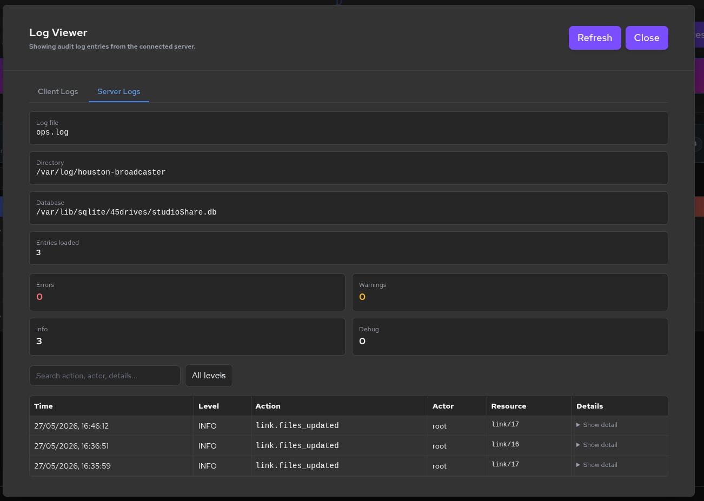

At the top, you'll see:

- **Log file** — The ops.log file name on the server (e.g., `ops.log`).
- **Directory** — The server-side log directory path (e.g., `/var/log/houston-broadcaster`).
- **Database** — The SQLite database path where structured audit entries are stored.
- **Entries loaded** — Total number of audit log entries in the database.

Each server log entry shows:

| Column | Description |
|--------|-------------|
| **Time** | Timestamp of the server event. |
| **Level** | Severity: INFO, WARN, or ERROR. |
| **Action** | The audit event name (e.g., `link.files_updated`, `annotation.created`, `transcode.cancelled`). |
| **Actor** | Username of who performed the action. |
| **Resource** | The resource type and ID affected (e.g., `link/17`, `annotation/42`). |
| **Details** | Expandable JSON payload with additional context. |

Server logs support **pagination** — use the Previous/Next buttons at the bottom to navigate through pages of results.

### Multi-Server Log Viewer

When connected to multiple servers, a **server selector dropdown** appears in the Server Logs tab. This lets you choose which server's audit log to view without disconnecting or switching your active server.

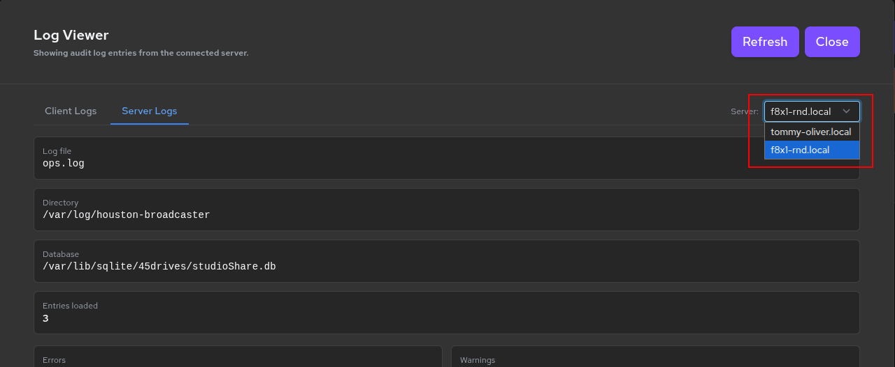

### Searching & Filtering Logs

| Control | Description |
|---------|-------------|
| **Search** | Filter by event name, summary text, details, actor, or resource. |
| **Level filter** | Show only a specific level: *All levels*, *Error*, *Warn*, *Info*, or *Debug* (client only). |
| **Errors/warnings only** | (Client tab) Quick toggle to show only error and warning entries. |
| **Group related events** | (Client tab) Groups similar events together to reduce visual duplication. |

> **Note:** Server Logs require admin (PAM) access. If you're logged in with a non-admin account, you'll see a message indicating that admin access is required.

> **Tip:** If you're experiencing connection or upload issues, check the Client Logs for `ERROR` entries. For server-side issues (transcodes failing, links not updating), check the Server Logs tab.

---

## 23. Frequently Asked Questions

**Q: What's the difference between Community and Pro editions?**  
A: There is only ONE 45Flow app. It works as Community Edition (free) by default, and automatically upgrades to Pro when connected to a licensed server. You don't download separate apps — Pro features simply unlock when the server has a valid license. Community includes all core file sharing and basic watermarking. Pro adds custom branding, advanced watermark customization, image watermarking, comments, annotations, and priority support.

**Q: How do I upgrade from Community to Pro?**  
A: Activate a license on your server. Go to **Settings → Go Pro**, enter your license key, and click **"Activate License"**. Once activated, all users connecting to that server immediately gain Pro features. You can also start a free 30-day trial from the same section.

**Q: Do I need a separate license for each user?**  
A: No. Licenses are tied to the server, not individual users. Once a server is licensed, all users connecting to it automatically get Pro features. You only need one license per server.

**Q: What happens when my trial expires?**  
A: When a trial license expires, the server reverts to Community mode. Pro features (custom branding, advanced watermarks, comments, annotations) are disabled. All existing links remain accessible, but you can't use Pro features until a full license is activated.

**Q: What are Projects and do I need to use them?**  
A: Projects are optional organizational containers that group links by client, campaign, or workflow. Each project has its own root directory and tracks link counts. Projects are helpful for managing many links, but you can still create links without assigning them to a project — they'll appear in the "All Links" view on the Dashboard.

**Q: How do I create a link that supports both sharing and uploading?**  
A: When creating a link, enable both **"Enable file sharing"** and **"Enable uploads"** toggles. This creates a Combined link where recipients can view/download your shared files AND upload their own files to the same location. Perfect for collaborative review workflows.

**Q: Can I watermark images, or just videos?**  
A: **Pro users** can watermark both videos and images. Community users can only watermark videos (with basic bottom-right positioning). Pro unlocks full watermark customization (position, scale, opacity, rotation) for both video and image files.

**Q: My server doesn't appear in the auto-discovery dropdown. What do I do?**  
A: The `houston-broadcaster` service must be running on the server. Try connecting manually using the server's IP address via the **"Connect manually via IP"** field.

**Q: External share links aren't working. What should I check?**  
A: Ensure port 443 (or your custom HTTPS port) is forwarded on your router. Use the **"Check Port"** button when creating a link to verify. Also confirm your external URL is correctly configured in **Settings**.

**Q: What file types are supported for upload?**  
A: 45Flow supports a wide range of media file types including:
- **Video:** MP4, MOV, MKV, AVI, WebM, BRAW, R3D, and more
- **Image:** JPG, PNG, TIFF, EXR, DPX, PSD, and more
- **Audio:** MP3, WAV, FLAC, AAC, AIFF, and more
- **Cinema/VFX:** DPX, CIN, EXR, HDR, DNG, RAW camera formats
- **Archives:** ZIP, TAR, GZ, 7Z, RAR
- **Documents:** PDF, SRT, VTT (subtitles), XML, CSV

**Q: What do review copies do?**  
A: Review copies are lower-resolution versions (720p, 1080p) of your videos. When enabled, shared links stream the review copy instead of the original, resulting in faster playback, reduced bandwidth usage, and protection of your original high-resolution files.

**Q: Can I change a link's settings after creating it?**  
A: Yes. Open the link's **Details** from the Dashboard and click **"Edit"**. You can change access mode, password, expiration, review copy/watermark settings, and the files attached to the link. Changes take effect immediately.

**Q: What happens when a link expires?**  
A: Expired links become inaccessible to anyone who tries to open them. The link remains in your Dashboard with an "Expired" status, so you can view its history or adjust its expiration to reactivate it.

**Q: Can I disable a link without deleting it?**  
A: Yes. Click **"Disable"** in the link's action column on the Dashboard. This immediately blocks access. You can re-enable it later with the **"Enable"** button.

**Q: How are uploaded files scanned for security?**  
A: All uploaded files go through a quarantine process with malware scanning before being moved to the destination folder. Files that fail the scan are rejected.

**Q: Where are my logs stored?**  
A: **Client logs** are stored in your local application data directory (shown in the Log Viewer's Client tab). **Server logs** (audit entries) are stored on the server in both a SQLite database and the ops.log file. You can view both from the Log Viewer — use the Client/Server tabs to switch.

**Q: I can't see Server Logs — it says "Admin access required". What do I do?**  
A: Server logs require a system (PAM) account login. If you logged in using an environment token or open access, you won't have admin privileges. Log in with your server's system username and password to access server logs and health stats.

**Q: How do I connect to multiple servers?**  
A: 45Flow supports multiple simultaneous server connections. After connecting to your first server, use the Connection Manager (from the server switcher dropdown in the header) to add additional servers. Each server maintains its own authentication and license state.

**Q: Can I view annotations created by other users?**  
A: Yes. All annotations are visible to anyone with access to the link. They appear as overlays on the video frame at the timecoded position where they were created.

---

*For additional support, contact your 45Drives representative or visit [45drives.com](https://www.45drives.com).*
